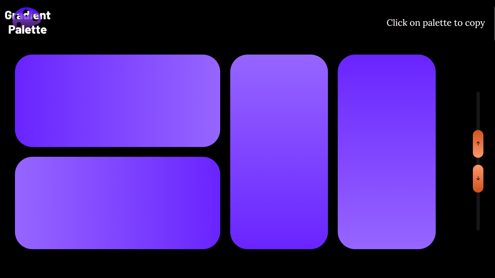
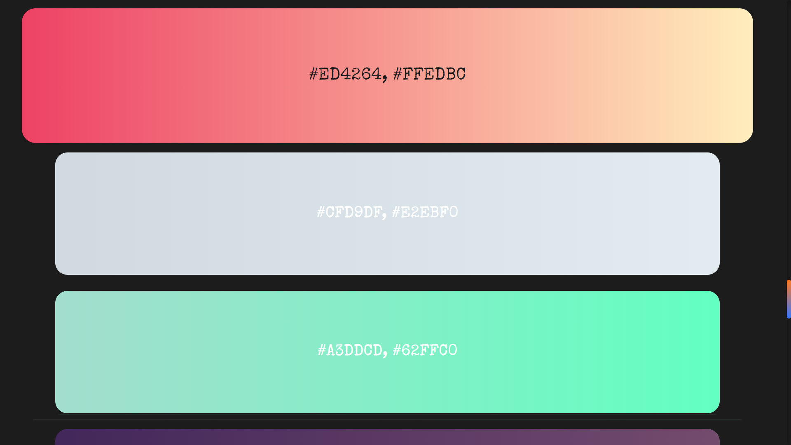

## Searching for Best Gradients for your project?
## Don't worry just click on the link below.
### [Gradients Palette](https://sagar-sharma-7.github.io/Gradients-Palette/)

### ```NOTE: Open the above link in Google Chrome...```

## If you have any gradient which you want to be part of my gradient palette then please pull request or write hex code of color in issues...
<hr>

<p align="center">
  
  <br>
  <br>
  
</p>

<hr>
<br>


<p float="left">

 
 
 

</p>
<hr>
<br>


## Fonts used in Color Palette
```css 
@import url('https://fonts.googleapis.com/css2?family=Merienda:wght@700&display=swap');
@import url('https://fonts.googleapis.com/css2?family=Special+Elite&display=swap');

.div1{
  font-family: 'Merienda', cursive;
}
.div2{
     font-family: 'Special Elite', cursive;
}
```

 ## Cloning this repositary using command line
 1. Open **Git Bash**.
 1. Change the current working directory to the location where you want the cloned directory.
 1. Type `git clone https://github.com/Sagar-Sharma-7/Gradients-Palette.git`
 1. Press **Enter** to create the clone of this repositary.


 ## How to reach me?
 [ ](mailto:6969sagarsharma@gmail.com)
 <hr>
 <br>

[](https://github.com/Sagar-Sharma-7)
 <hr>
 <p float="left">

[](https://github.com/Sagar-Sharma-7)
[ ](https://github.com/Sagar-Sharma-7)

</p>


[](https://github.com/Sagar-Sharma-7)

